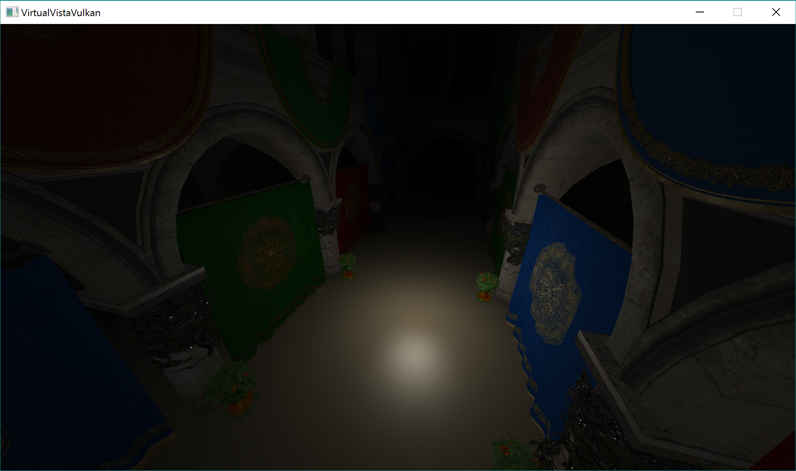

Virtual Vista Vulkan
==================

This is my attempt at learning the Vulkan graphics API while writing a physically based rendering engine.

It currently supports:
* analytic light sources
* HDR image-based lighting
* physically based material shading with a GGX Cook-Torrance BRDF
* manual specification of models + lights to be loaded at initialization time
* loading models with multiple submeshes
* plug and play architecture

I mainly follow these [course notes](http://blog.selfshadow.com/publications/s2013-shading-course/karis/s2013_pbs_epic_notes_v2.pdf) (by Epic) which details their method of calculating the reflectance equation through a split sum approximation.

A precomputation phase of generating convolved specular environment maps and cos(theta) x roughness BRDF LUT is left out to maintain engine design.




Installing
-----

```
git clone --recursive https://github.com/romanlarionov/VirtualVistaVulkan.git
```

Build with CMake (It should just work)

> any used shaders will have to be compiled prior to running executable

This has been tested and runs on Windows 10 with an Nvidia GTX 970

Dependencies
------------

* [LunarG Vulkan SDK](https://vulkan.lunarg.com/) - all Vulkan API support
* GLFW - surface and input 
* GLM - linear algebra
* GLI - compressed HDR texture loading
* SPIRV-Cross - runtime shader reflection
* stb_image - uncompressed texture loading
* tiny_obj_loader - OBJ + MTL loading

All of these are included with the repository when cloned recursively, with the exception of the LunarG Vulkan SDK. You would have to download and install that manually.

Assets
------

* [Cerberus](http://artisaverb.info/Cerberus.html)
* [9mm Pistol](http://bigrookgames.com/portfolio-items/9mm-pistol/?portfolioCats=127%2C253%2C154%2C165%2C147%2C216)
* [Crytek Sponza](http://graphics.cs.williams.edu/data/meshes.xml)

Referances
---------
* [vulkan-tutorial.com](https://vulkan-tutorial.com/)
* [Sascha Willems Examples](https://github.com/SaschaWillems/Vulkan)
